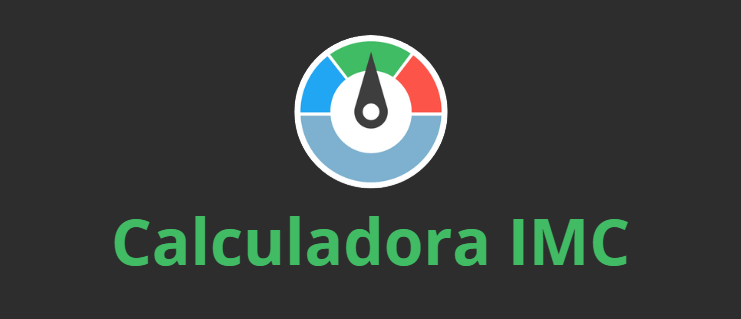

<h1 align="center">
    
</h1>

    <h3> 🟢 Descubra seu IMC facilmente! 🟢 </h3>

## Calculadora-IMC

Projeto de calculadora de IMC.

  

## 🛠️ Tecnologias
<ul>
 <dd> HTML5</dd>
 <dd> CSS3</dd>
 <dd> JavaScript</dd>
</ul> 

### 🖥️ Desktop
gif
